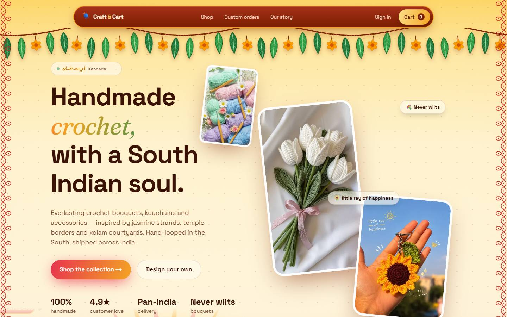
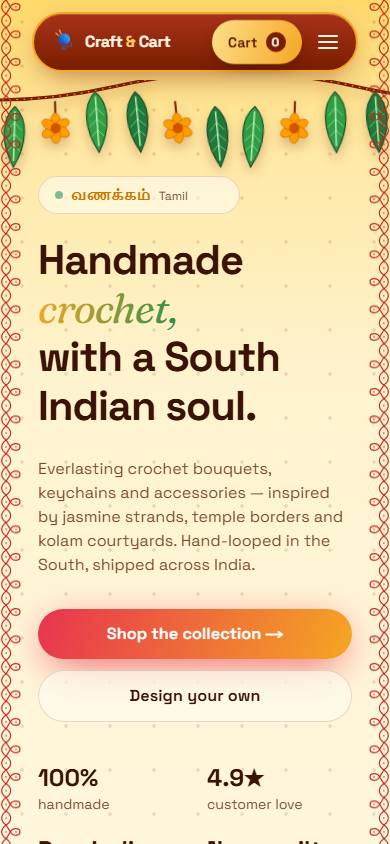
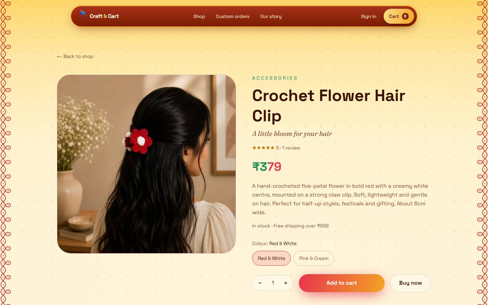
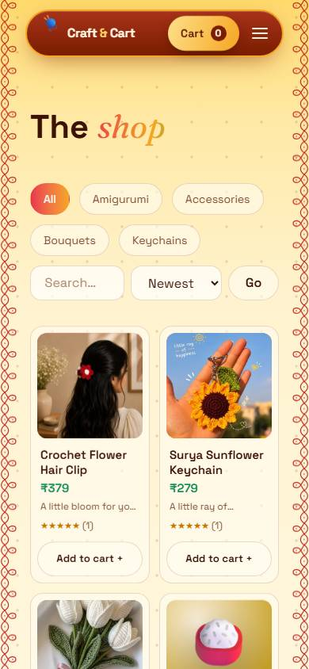

# Craft & Cart — Handmade Crochet Store

A full-stack online store for handmade crochet: bouquets that never wilt, keychains, hair accessories and amigurumi,
wrapped in a South Indian (Pongal) design with smooth animations. Customers can browse, add to cart, and check out with
**PhonePe** (UPI, cards, netbanking) or **Cash on Delivery**; the owner manages orders from an **admin dashboard**.

<table>
  <tr>
    <td width="68%"></td>
    <td width="32%"></td>
  </tr>
  <tr>
    <td></td>
    <td></td>
  </tr>
</table>

> This repository is named **craft**. The website itself is in the [`craft-and-cart/`](craft-and-cart) folder.

---

## Table of contents

1. [Features](#features)
2. [Tech stack](#tech-stack)
3. [Repository layout](#repository-layout)
4. [Run it locally](#run-it-locally)
5. [Environment variables](#environment-variables)
6. [npm scripts](#npm-scripts)
7. [How payments work](#how-payments-work)
8. [Database](#database)
9. [Pages and API routes](#pages-and-api-routes)
10. [Deploy it online](#deploy-it-online)
11. [Security notes](#security-notes)
12. [Known limitations](#known-limitations)
13. [Troubleshooting](#troubleshooting)

---

## Features

**Storefront**
- Home page with an animated hero, collections, bestsellers, festival gifting, a "how it works" story and a custom-order form.
- Shop with category filters, search and price sorting; product pages with photos, colour options and customer reviews.
- Products and prices always come from the database, never from the browser.

**Cart and checkout**
- Cart that remembers items between visits, with a free-shipping progress bar (free over ₹999, otherwise ₹79).
- Checkout with address validation and a choice of **PhonePe** or **Cash on Delivery**.
- Order status page that updates itself while a payment is being confirmed; stock is reduced only when an order is confirmed.

**Accounts and admin**
- Customer sign-up and sign-in (passwords hashed with bcrypt, session in an httpOnly cookie), and an "My orders" page.
- Admin dashboard: revenue, order list with a status dropdown, low-stock warnings, and custom-order requests.
- Newsletter sign-up and custom-order requests are saved in the database.

**Design and experience**
- South Indian Pongal theme: mango-leaf garland, sunrise scene with a boiling Pongal pot, kolam borders and greetings in Tamil, Malayalam, Telugu and Kannada.
- Smooth scrolling, animated product cards, a flying "add to cart" animation and a confetti burst after an order (all respect "reduce motion").
- Fully responsive: hamburger menu on phones, two-column product grids, 44 px tap targets, lighter effects on small screens.

## Tech stack

| Area | Technology |
|---|---|
| Framework | [Next.js](https://nextjs.org) 16 (App Router) with React 19 and TypeScript |
| Styling | Tailwind CSS v4 and a custom design system in `globals.css` |
| Animation | GSAP, Lenis (smooth scroll), Motion, hand-drawn SVG scenes |
| State | Zustand (cart, saved in the browser) |
| Database | PostgreSQL through the `pg` driver (plain SQL, no ORM) |
| Auth | `jose` (signed JWT in an httpOnly cookie) and `bcryptjs` |
| Validation | `zod` on every API route |
| Payments | PhonePe Payment Gateway (Standard Checkout v2) and Cash on Delivery |
| Hosting | Docker on your own VPS behind Nginx (see [Deploy it online](#deploy-it-online)); also runs on any Node.js host |

## Repository layout

```
craft/
├── README.md                 ← you are here
├── render.yaml               ← one-click deploy to Render (website + database)
├── craft-and-cart/           ← THE WEBSITE
│   ├── src/app/              pages and API routes (shop, product, checkout, order, admin, ...)
│   ├── src/components/       UI: navbar, hero, scenes, product cards, cart drawer, ...
│   ├── src/lib/              database, auth, cart, money, orders and PhonePe helpers
│   ├── db/schema.sql         database tables
│   ├── scripts/              local database server and the seed script
│   ├── public/               product photos and images
│   ├── docs/screenshots/     screenshots used in this README
│   ├── .env.example          every setting the site understands (copy to .env.local)
│   └── DEPLOY.md             alternative deployment guide (Railway)
├── crochet_website/          an early Flask test (not used by the store)
└── template/                 an early HTML test page (not used by the store)
```

## Run it locally

**You need:** [Node.js](https://nodejs.org) 20.9 or newer (developed on Node 24) and npm. You do **not** need to install
PostgreSQL: the project can start its own copy.

```bash
git clone https://github.com/Vimal-Raj-003/craft.git
cd craft/craft-and-cart

npm install

# 1. create your settings file
cp .env.example .env.local        # Windows PowerShell: Copy-Item .env.example .env.local

# 2. start the built-in PostgreSQL (leave this running in its own terminal)
npm run db:start

# 3. in a second terminal: create the tables, products and the admin account
npm run db:seed

# 4. start the website
npm run dev
```

Open **http://localhost:3000**.

The seed script creates 17 sample products across four collections and one admin account. For local use the admin login
is `admin@craftandcart.local` with the demo password `admin12345`, or whatever you put in `ADMIN_PASSWORD`.
**Never use the demo password on a public site** (the seed script refuses to create a weak admin for an online database).

Prefer your own PostgreSQL? Create a database, run `db/schema.sql` in it, set `DATABASE_URL` in `.env.local`, run
`npm run db:seed`, and skip `npm run db:start`.

## Environment variables

Copy [`craft-and-cart/.env.example`](craft-and-cart/.env.example) to `.env.local`. It is never committed.

| Variable | Needed | What it does |
|---|---|---|
| `DATABASE_URL` | always | PostgreSQL connection string. Local default is the built-in database. |
| `DATABASE_SSL` | if your host requires it | `true` to connect over SSL. |
| `JWT_SECRET` | **required in production** | Signs login cookies. Use a long random string. |
| `ADMIN_EMAIL` / `ADMIN_PASSWORD` | when seeding | The admin account. The password is **required** (10+ characters) for an online database. |
| `NEXT_PUBLIC_SITE_URL` | for PhonePe | Your public address; PhonePe returns customers here. |
| `PHONEPE_ENV` | for PhonePe | `sandbox` for testing, `production` when live. |
| `PHONEPE_CLIENT_ID`, `PHONEPE_CLIENT_SECRET`, `PHONEPE_CLIENT_VERSION` | for PhonePe | Credentials from the PhonePe merchant dashboard. |
| `PHONEPE_WEBHOOK_USER` / `PHONEPE_WEBHOOK_PASS` | for PhonePe | Credentials PhonePe uses to prove a webhook is genuine; you choose them. |

## npm scripts

Run these inside `craft-and-cart/`.

| Command | What it does |
|---|---|
| `npm run dev` | Start the website in development mode with live reload. |
| `npm run build` / `npm start` | Build and run the production version. |
| `npm run lint` | Check the code style. |
| `npm run db:start` | Start the built-in local PostgreSQL (port 54329, data in `.pgdata/`). |
| `npm run db:seed` | Create tables and sample data for local development (reads `.env.local`). |
| `npm run db:setup` | Same, for a hosted database (reads settings from the environment). Safe to repeat. |

## How payments work

At checkout the customer chooses:

- **Cash on Delivery:** the order is confirmed immediately with status `confirmed`.
- **PhonePe:** the server creates a PhonePe order and sends the customer to PhonePe (the PhonePe app opens on phones).
  When they come back, and again when PhonePe calls the webhook, the **server asks PhonePe for the real status** before
  marking the order `paid`. The browser is never trusted for the result.

**Setting up PhonePe:** create a merchant account at <https://business.phonepe.com>, copy the Client ID, Client Secret and
Client Version into `.env.local`, and set the webhook to `https://<your-site>/api/webhooks/phonepe` with the events
`checkout.order.completed` and `checkout.order.failed`.

**Without PhonePe keys**
- On your own computer, "Pay online" runs in a **demo mode** that simulates a successful payment (no money moves).
- On a live site (`NODE_ENV=production`), "Pay online" is **switched off** with a clear message and only Cash on Delivery
  works. Fake payments can never be created online.

## Database

Tables are defined in [`db/schema.sql`](craft-and-cart/db/schema.sql): `users`, `categories`, `products`, `orders`,
`order_items`, `reviews`, `custom_requests` and `newsletter`. Prices are stored in paise (integers), orders keep a copy of
each item's name and price, and the schema is safe to run repeatedly.

The seed script ([`scripts/seed.ts`](craft-and-cart/scripts/seed.ts)) defines the catalogue. To change products, edit it and
run the seed command again. On an online database it never resets your stock numbers and adds no sample reviews.

## Pages and API routes

| Page | Purpose |
|---|---|
| `/` | Home |
| `/shop`, `/product/[slug]` | Browse and view products |
| `/checkout`, `/order/[id]` | Checkout and order status |
| `/login`, `/account` | Sign in, order history |
| `/admin` | Admin dashboard (admin accounts only) |

| API route | Purpose |
|---|---|
| `GET /api/products` | Product list (filters: `category`, `q`, `sort`, `featured`) |
| `POST /api/auth/[register\|login\|logout]`, `GET /api/auth/me` | Accounts and sessions |
| `POST /api/checkout`, `POST /api/checkout/verify` | Create an order; demo-payment confirmation (local only) |
| `POST /api/webhooks/phonepe` | PhonePe payment notifications (signature-checked) |
| `POST /api/contact/[newsletter\|custom]` | Newsletter and custom-order requests |
| `GET/PATCH /api/admin/orders` | Admin order list and status changes (admin only) |

## Deploy it online

### Your own VPS with Docker (recommended; used for craft.jilljill.in)

The full step-by-step runbook is [`craft-and-cart/DOCKER.md`](craft-and-cart/DOCKER.md). In short, the stack is two
containers on a private Docker network: `craft-web` (the site, published only on `127.0.0.1:3215`) and `craft-db`
(PostgreSQL 16 Alpine, no published port, data in the `craft_db_data` volume). Your existing Nginx terminates HTTPS and
proxies `craft.jilljill.in` to `127.0.0.1:3215` (ready-made config: `craft-and-cart/deploy/nginx/craft.jilljill.in.conf`).

```bash
cd craft-and-cart
cp .env.production.example .env.production      # then fill in CRAFT_DB_PASSWORD and JWT_SECRET (openssl rand -hex ...)
docker compose -p craft -f docker-compose.production.yml --env-file .env.production build
docker compose -p craft -f docker-compose.production.yml --env-file .env.production up -d
ADMIN_PASSWORD='<10+ characters>' docker compose -p craft -f docker-compose.production.yml --env-file .env.production \
  run --rm -e ADMIN_PASSWORD craft-web node scripts/db-setup.cjs      # once: tables, products, admin login
curl -s http://127.0.0.1:3215/api/health                              # {"ok":true}
```

`deploy/smoke-test.sh` checks the live site end to end (health, pages, admin sign-in, secure cookie, `/api/auth/me`).

### Other Node.js hosts

Nothing in the code is tied to a particular host. On any server with Node.js 20+ and PostgreSQL:

```bash
cd craft-and-cart
npm ci --include=dev
# set DATABASE_URL, JWT_SECRET, NEXT_PUBLIC_SITE_URL (and PHONEPE_*) in the environment or in .env.production
ADMIN_PASSWORD='<10+ characters>' npm run db:setup     # once
npm run build
npm start                                                # listens on port 3000 (set PORT to change)
```

Put it behind a reverse proxy that provides HTTPS and keep it running with `pm2` or `systemd`.
[`render.yaml`](render.yaml) (Render) and [`craft-and-cart/DEPLOY.md`](craft-and-cart/DEPLOY.md) (Railway) are also
available as alternatives.

## Security notes

- No passwords, keys or `.env` files are stored in this repository; `.gitignore` also excludes `venv`, caches and the local database.
- Every API input is validated with `zod`; every database query is parameterised.
- Passwords are hashed with bcrypt; sessions are signed, httpOnly cookies. The site refuses to start sessions in production without `JWT_SECRET`.
- Order totals, prices and stock are always calculated on the server.
- Payment results come only from PhonePe's status API, and webhooks must carry the correct signature.
- Admin pages and the admin API check the user's role on every request.

## Known limitations

- Some products still show an illustrated placeholder instead of a photo; add images in `public/products/` and set `image_url` in the seed.
- Product names, prices and descriptions in the seed are sample content. Replace them with your real catalogue.
- Line items such as "100% handmade" and "4.9★ customer love" on the home page are fixed text, not live data.
- Customers cannot write reviews yet; reviews are read-only.
- There is no email or SMS notification yet; new orders appear in the admin dashboard.
- There is no in-app product editor yet; products are managed through the seed script.

## Troubleshooting

| Problem | Fix |
|---|---|
| `connect ECONNREFUSED` / the site shows no products | The database is not running: start it with `npm run db:start`, then `npm run db:seed`. |
| Port 3000 or 54329 is already in use | Stop the other program, or run `npm run dev -- -p 3100` (and set `PGPORT` for the database). |
| "JWT_SECRET must be set in production" | Add a `JWT_SECRET` environment variable on your host. |
| "Online payment isn't available yet" on the live site | Add the `PHONEPE_*` variables; until then only Cash on Delivery works. |
| Seeding an online database refuses to run | Set `ADMIN_PASSWORD` (10+ characters) in the environment first. |
| `npm run db:start` fails on first run | Delete the `.pgdata/` folder and run it again to recreate the local database. |

---

Made with love and a lot of yarn.
